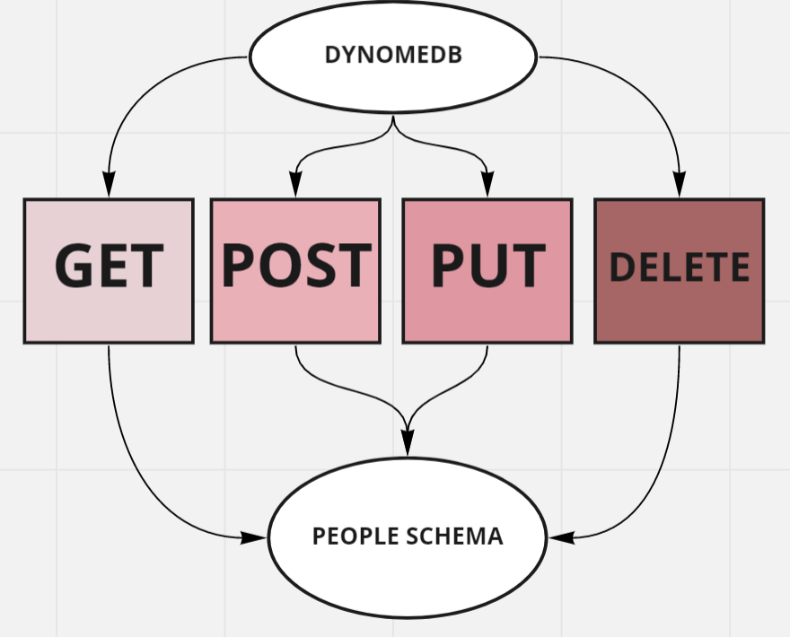

# serverless-api

### root URL to your API:
[root url](https://wpbzckm0n6.execute-api.us-east-1.amazonaws.com/)

### the routes:
- **GET:** [GET-URL](https://wpbzckm0n6.execute-api.us-east-1.amazonaws.com/people)
- **GET BY ID:** [GET-BY-ID](https://wpbzckm0n6.execute-api.us-east-1.amazonaws.com/people/{id})
- **POST:** [POST-URL](https://wpbzckm0n6.execute-api.us-east-1.amazonaws.com/people)
- **PUT:** [PUT-URL](https://wpbzckm0n6.execute-api.us-east-1.amazonaws.com/people/{id})
- **DELETE:** [DELETE-URL]( https://wpbzckm0n6.execute-api.us-east-1.amazonaws.com/people/{id})

### inputs do they require:

- **GET:** non
- **GET BY ID:** id
- **POST:** object
- **PUT:** id & object
- **DELETE:** id 

### output do they return:

- **GET:** arry with the data in DB
- **GET BY ID:** return the object with the id in the request
- **POST:** create new object
- **PUT:** update object
- **DELETE:** Empty object

### UML:

